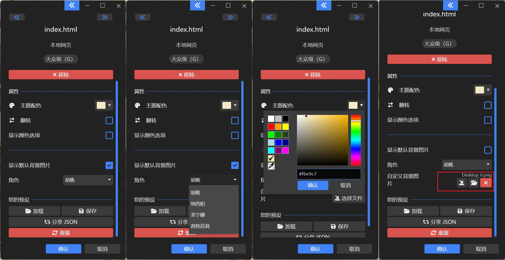

# 米哈游可切换角色背景动态壁纸

## 0. 视频

- B 站演示: [BilBil](https://www.bilibili.com/video/BV1vbrWYiEzX)

## 1. 基本信息

- 作者: 啊是特嗷桃
- 系列: 复刻系列 (衍生 [wallpaper 壁纸引擎](https://www.wallpaperengine.io/) 用)
- 网站: [网页版在线预览](https://gmcy2020.github.io/Reprint-MiniForBg/) (没有搞大小适配, 建议横屏看; 这个不能切角色, 只能在wallpaper中切)
- 仓库: [GitHub](https://github.com/GMCY2020/Reprint-MiniForBg) | [Gitee](https://gitee.com/GMCY2020/Reprint-MiniForBg)
- 话题(GitHub): [vue](https://github.com/topics/vue) \ [reprint](https://github.com/topics/reprint) \ [mihoyo](https://github.com/topics/mihoyo) \ [Genshin Impact](https://github.com/topics/genshin-impact) \ [wallpaper](https://github.com/topics/wallpaper)
- 创建时间: 2025/01/04

## 2. 介绍

- 该项目为往期复刻系列的衍生, 可用于 [wallpaper 壁纸引擎](https://www.wallpaperengine.io/).
- 实时渲染米哈游角色动态图
- 角色目前包括 胡桃，纳西妲，芙宁娜，茜特菈莉
- 可自定义背景图片
- 可自定义背景颜色
- 项目所需动图等资源来自米哈游官网, 仅编程学习用
- 基本信息中的网站, 国内访问 GitHub 网络问题. 可能有延迟, 资源加载等问题. 项目下载到本地应该不卡.
- 个人学习自用

## 3. 环境

编辑器

- `VSCode`

框架

- `vue3`
- `spine`

## 4. 使用

- 下载 项目 并 解压
- 找到 `index.html` 文件
- 拖入 `WallPaper壁纸引擎` 即可使用.

## 5. 效果图

胡桃

纳西妲

芙宁娜

茜特菈莉

自定义背景颜色

自定义背景图片

WallPaper 控制

